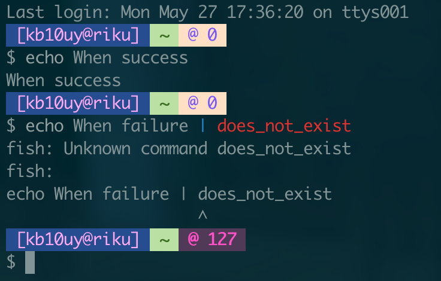

# fish-theme-ract
Made by Japanese otaku

## Features
* Username
* Host
* Current directory
* Return status code
* TrueColor enabled

## Install
`fisher add 'kb10uy/fish-theme-ract'

## Not so Frequently Asked Questions

### What does `ract` stands for?
It is intial letters of my favorite characters.
Google Image Search links are listed below.

* [Riku Yuuki](https://www.google.com/search?tbm=isch&q=結城莉玖)
* [Aiko Takamori](https://www.google.com/search?tbm=isch&q=高森藍子)
* [Cocoa Hoto](https://www.google.com/search?tbm=isch&q=保登心愛)
* [Tenshi Hinanawi](https://www.google.com/search?tbm=isch&q=比那名居天子)

